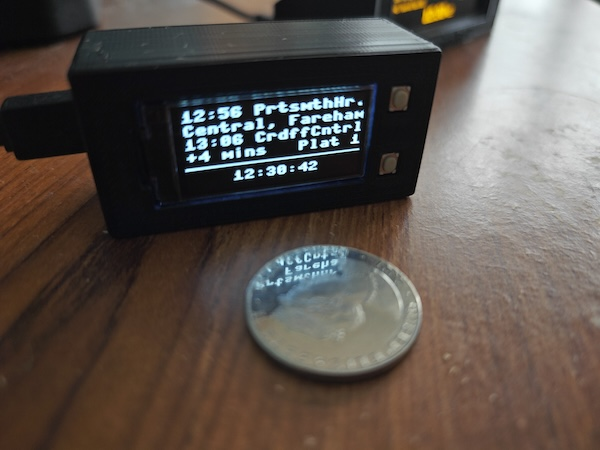

# Pico Departure Board

## Overview

This is a departure board for a train station, running on a Raspberry Pi Pico W with a Waveshare 1.3inch OLED HAT. There are many bigger departure boards in the world, this was a fun challenge to fit on a tiny screen. It's not perfect, but it works!



## Hardware

- Raspberry Pi Pico WH (with pre-soldered headers)
- Waveshare 1.3inch OLED HAT (128x64, SPI)

The OLED HAT connects directly to the top of the Pico WH. No soldering required.

The screen has two buttons which are used for controls:

- **"KEY0"**: Toggle the clock display on/off
- **"KEY1"**: Scroll through later departures
- **Both buttons held**: Enter setup mode

## Initial Setup


## Deploying to the Pico

### 1. Install MicroPython firmware

1. Hold the **BOOTSEL** button on the Pico and plug it into your computer via USB. It will appear as a USB drive called `RPI-RP2`.
2. Download the latest MicroPython `.uf2` firmware for the **Pico W** from [micropython.org/download/RPI_PICO_W](https://micropython.org/download/RPI_PICO_W/).
3. Drag the `.uf2` file onto the `RPI-RP2` drive. The Pico will reboot automatically.

### 2. Upload the code

I use [VS Code](https://code.visualstudio.com/) with the **MicroPico** extension (`paulober.pico-w-go`):

1. Install the extension and open this project folder in VS Code.
2. Connect the Pico via USB.
3. Open the command palette (`Cmd+Shift+P` / `Ctrl+Shift+P`) and run **MicroPico: Upload project to Pico**.

This uploads all project files to the Pico's filesystem. The board will run `main.py` automatically on boot.

Alternatively, you can use [Thonny](https://thonny.org/) or [mpremote](https://docs.micropython.org/en/latest/reference/mpremote.html) to copy files manually.

### 3. Configure

Whichever method you choose, you'll need the following infromation:

- An API token from https://realtime.nationalrail.co.uk/OpenLDBWSRegistration/
- A station code from https://en.wikipedia.org/wiki/UK_railway_stations
- Your WiFi credentials
- Optional: A platform number to filter by

#### Option A: WiFi

On first boot, the board will start in setup mode automatically. You can also enter setup mode at any time by holding both buttons simultaneously.

1. Connect to the **PDBSetup-XXXX** WiFi network from your phone or laptop.
2. A captive portal page should open automatically. If not, navigate to any non-HTTPS URL in your browser. (e.g http://pdb.setup)
3. Fill in your WiFi credentials, API token, station code, and station name. (The name will be displayed when there are no departures to show)
4. Press **Save**. The board will restart and connect to your WiFi.

#### Option B: Edit JSON files manually

If you prefer, you can edit the config files directly on the Pico's filesystem or before uploading the code.

`wifi.json`:

```json
{
    "ssid": "<your-ssid>",
    "password": "<your-password>"
}
```

`api.json`:

```json
{
    "api_token": "<your-api-token>",
    "station_code": "<your-station-code>",
    "platform": "<platform number/letter>",
    "station_name": "<your-station-name>",
    "show_splash_screens": true
}
```

### 4. Enjoy

The next time the board boots, you should see the boot screen, then a WiFi connection message, followed by live departures for your chosen station. If a config file is missing or invalid, an error message will be shown on the display.

## Constants

There are a few constants that control the behaviour of the departure board that you can tweak in `main.py`:

- **WIFI_MINIMUM_CONNECTION_ATTEMPTS**: The minimum number of WiFi connection attempts to make before proceeding - I used mainly to simulate a slow WiFi connection and test that the status screen was displayed.
- **WIFI_MAXIMUM_CONNECTION_ATTEMPTS**: The maximum number of WiFi connection attempts to make before giving up. If this is reached, the screen will display an error message and wait for a manual reset.
- **DEPARTURE_REFRESH_SECONDS**: The number of seconds to wait between data refreshes.
- **DELAY_PLATFORM_DISPLAY_MS**: The time in milliseconds to display the delay/platform information before switching to a scrolling list of calling points.
- **CALLING_AT_PAUSE_MS**: The delay in milliseconds between the calling points start to scroll.
- **CALLING_AT_SCROLL_MS**: The delay in milliseconds between movements of the calling points list.
- **API_TIMEOUT_SECONDS**: The timeout in seconds for each API request.
- **ROTATE_SCREEN**: Whether to rotate the screen - in case you want to mount it upside down or with the power connector on the other side.
- **TIME_SYNC_HOUR_UTC**: The hour in UTC when we sync the time with an NTP server and check if we have started/finished BST.

## Implementation notes

Train station names are difficult to display on such a small screen, so we need to truncate them. The longest one I've found is "Rhoose Cardiff International Airport"* (34 characters). The OLED screen is 128 pixels wide, and the font is 8 pixels wide, so we can fit 16 characters per line.

Even so, font size 8 is quite large, so we can only fit 14 characters per line. To do: Investigate if we can use a smaller font for some items (e.g platform, status, etc)

* It's NOT Llanfairpwllgwyngyllgogerychwyrndrobwllllantysiliogogogoch, which is officially called "[Llanfairpwll](https://www.nationalrail.co.uk/stations/llanfairpwll/)".

## Future ideas

- It'll need a 3d printed case
- It could be battery powered and portable or even wearable
- Need to find a way to display calling stations
- Limit to a specific platform, or destination(s)
- It could still be smaller...
- Better error handling!
- ~~Onboard WiFi configuration without having to write a file to the Pico~~ Done! Captive portal setup mode.
- ~~Onboard station configuration~~ Done!
- ~~Onboard API configuration (Maybe press both buttons to enter this mode)~~ Done!
- Demo mode (No internet connection required, show an example departure board with times based on the current time)

## Author

Created by [Oli Allen](https://oliallen.com). Read more about this project on [my blog](https://www.oliciv.net/pico-departure-board).

- GitHub: [oliciv/pico-departure-board](https://github.com/oliciv/pico-departure-board)

## License

This project is licensed under the terms of the GNU General Public License v3.0. It includes code from the following sources:

- [Waveshare Pico_code](https://github.com/waveshare/Pico_code/blob/main/Python/Pico-OLED-1.3/Pico-OLED-1.3(spi).py) - GPL-3.0
